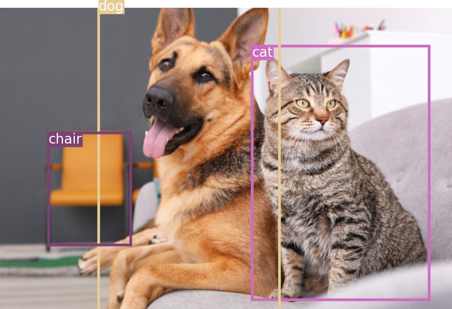
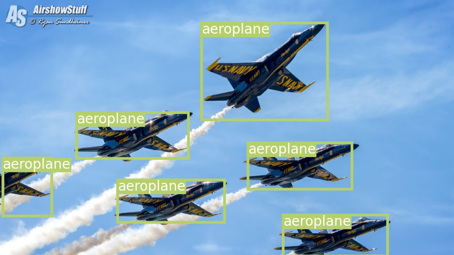

# Multiple Object Detection and Tracking with PyTorch

This is our ([Francesco Vidaich](https://github.com/francescovidaich964), [Stefano Mancone](https://github.com/mango915)) final project for the [Vision and Cognitive services](http://informatica.math.unipd.it/laureamagistrale/visionandcognitiveservicesen.html) course of our [Pysics of Data](https://www.unipd.it/en/educational-offer/master-s-degrees/school-of-science?tipo=LM&scuola=SC&ordinamento=2018&key=SC2443) degree at the University of Padova.
Here we implemented a YOLOv3 architecture, trained on the COCO dataset, to solve the problem of Multiple Object Detection and the SORT (Simple Online and realtime Tracking) algorithm that, combined with the previous model, will solve the problem of Multiple Object Tracking.
We also introduced some metrics to evaluate the how well the model performs.


## Running image detection

Before running the code, you will need to download the weights of the YOLOv3 network by running the `download_weights.sh` script inside the `pytorch_objectdetecttrack/config` folder.

The code can be executed running the following command inside the `pytorch_objectdetecttrack` directory:
```
python PyTorch_Object_Detection.py <image_name>
```
where `<image_name>` is the filename of the image of which we want to perform Multi Object Detection.
If no argument is given, the script will use a default image. Every image that we want to analyze with the 
`PyTorch_Object_Detection.py` script needs to be stored in the `pytorch_objectdetecttrack/images` folder.


## Running video tracking

In addition to downloading the weights if the trained YOLOv3, you will need also to install [FFmpeg](https://ffmpeg.org/) in order to build videos from the sequence of their frames.

To run the code, use the following script:
```
 ./init_mot.sh <build_flag> <dataset>
```
There are two arguments:
 - `<dataset>`: name that identifies the dataset directory `data/MOT_datasets/<dataset>`. The dataset needs to have the same format of the training sequences provided by [MOTChallenge](https://motchallenge.net/), where the frames of the video are contained in the `<dataset>/img1` folder and the Ground Truth detections in the `<dataset>/gt/gt.txt` file. If the argument is not given (or it is not valid), the code will use the dataset already loaded in `data/images`.
 - `<build_flag>`: Code will perform the tracking task, build the tracked video and the one containing the Ground Truth detections only if this flag is equal to `True`. If not, the code will just evaluate the already built results using various metrics.


## Some Results

### Multi Object Detection
Here are some results of the detection task:

<table><tr>
<td>  </td>
<td>  </td>
</tr></table>

### Multi Object Tracking
Here we report a sequence from the MOT16 dataset: on the left there are our results, on the right there are the corresponding Ground Truth detections.

<table><tr>
<td>  </td>
<td>  </td>
</tr></table>


## References

This project has been developed starting from two repositories ([pytorch_objectdetecttrack](https://github.com/cfotache/pytorch_objectdetecttrack)[py-motmetrics](https://github.com/cheind/py-motmetrics)), which provided the tools that form the backbone of this work.
The complete bibliography can be found at the end of our [report](Mancone_Vidaich_Report_CV.pdf)